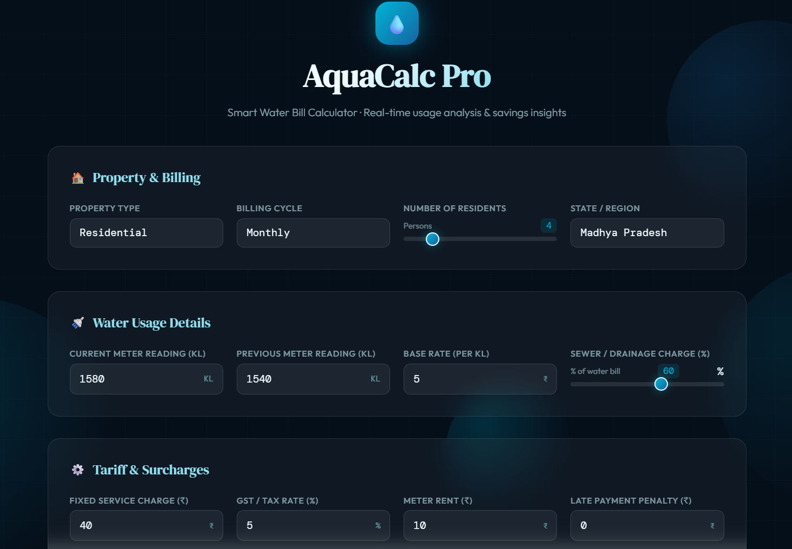
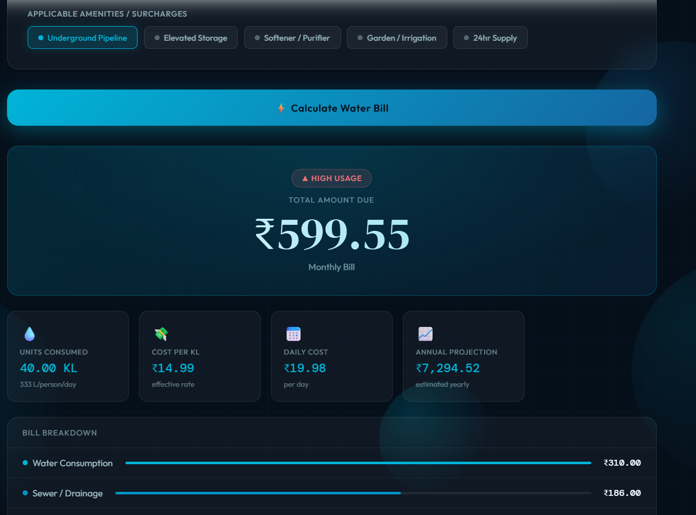
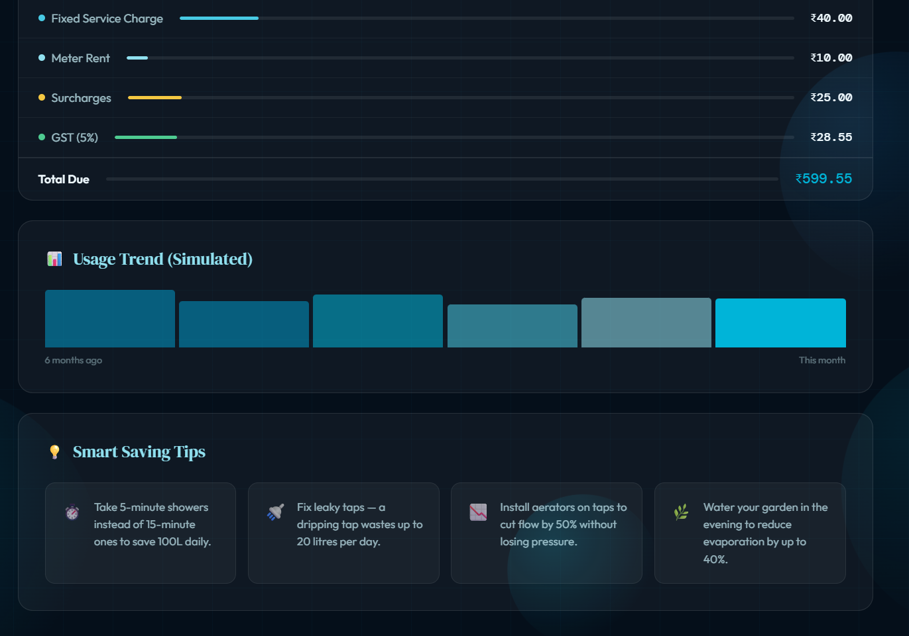

# 💧 AquaCalc Pro — Smart Water Bill Calculator

A beautifully designed, real-time water bill calculator with usage analysis and savings insights. Built with pure HTML, CSS, and JavaScript — no frameworks required.

---

## 📸 Screenshots

### 1. Input Form — Property & Billing Details
> **Suggested filename:** `aquacalc-input-form.png`



The main input screen allows users to configure:
- Property type and billing cycle
- Number of residents (slider)
- State/region selection
- Current and previous meter readings (KL)
- Base rate per KL and sewer/drainage charge percentage
- Fixed service charge, GST rate, meter rent, and late payment penalty

---

### 2. Calculation Results — Bill Summary & Metrics
> **Suggested filename:** `aquacalc-results-summary.png`



The results dashboard displays:
- **Total Amount Due** with a usage status badge (Low / Moderate / High)
- Key metrics: units consumed, effective cost per KL, daily cost, annual projection
- A detailed **Bill Breakdown** with proportional bar indicators for each charge component

---

### 3. Usage Trend & Saving Tips
> **Suggested filename:** `aquacalc-trend-tips.png`



Bottom section includes:
- A **6-month simulated usage trend** mini bar chart with hover tooltips
- **Smart Saving Tips** — 4 randomly selected water-conservation suggestions

---

## ✨ Features

- **Slab-based tariff calculation** — applies progressive rates across consumption tiers
- **Sewer/drainage charge** — configurable as a percentage of the base water charge
- **Toggle surcharges** — underground pipeline, elevated storage, softener/purifier, garden irrigation, 24hr supply
- **GST & fixed charges** — meter rent, late payment penalty, and tax all factored in
- **Usage status badge** — categorizes consumption as Low / Moderate / High based on litres per person per day
- **Bill breakdown** — proportional bar chart for each charge component
- **Simulated usage trend** — 6-month historical bar chart with hover tooltips
- **Annual projection** — estimates yearly spend based on current cycle
- **Smart Saving Tips** — 4 randomized water-conservation tips on each calculation
- **Animated background** — floating bubbles and grid overlay for a polished UI
- **Fully responsive** — works on mobile and desktop

---

## 🚀 Getting Started

No installation required. Just open the HTML file in any modern browser.

```bash
# Clone or download the project
open index.html
```

---

## 🧮 How the Calculation Works

```
Units Consumed     = Current Meter Reading − Previous Meter Reading

Water Charge       = Slab tariff on units consumed
                     Slab 1 (0–10 KL):  base rate × 1.0
                     Slab 2 (10–20 KL): base rate × 1.5
                     Slab 3 (20–30 KL): base rate × 2.2
                     Slab 4 (30+ KL):   base rate × 3.0

Sewer Charge       = Water Charge × (Sewer %)

Subtotal           = Water Charge + Sewer Charge + Fixed Charge
                   + Meter Rent + Surcharges + Penalty

GST                = Subtotal × (GST %)

Total Due          = Subtotal + GST
```

---

## 📁 File Structure

```
aquacalc-pro/
├── index.html                    # Single-file application
├── README.md                     # This file
└── screenshots/
    ├── aquacalc-input-form.png   # Input form screenshot
    ├── aquacalc-results-summary.png  # Results & breakdown screenshot
    └── aquacalc-trend-tips.png   # Usage trend & tips screenshot
```

---

## 🛠️ Tech Stack

| Layer      | Technology                          |
|------------|-------------------------------------|
| Markup     | HTML5                               |
| Styling    | CSS3 (custom properties, grid, flexbox, animations) |
| Logic      | Vanilla JavaScript (ES6+)           |
| Fonts      | Google Fonts — DM Serif Display, DM Mono, Outfit |

---

## 🎨 Design System

| Token       | Value           | Usage                        |
|-------------|-----------------|------------------------------|
| `--deep`    | `#050f1a`       | Page background              |
| `--ocean`   | `#0a2540`       | Card / select background     |
| `--aqua`    | `#00b4d8`       | Primary accent               |
| `--foam`    | `#90e0ef`       | Headings, highlights         |
| `--gold`    | `#f4c842`       | Moderate usage badge         |
| `--success` | `#4ecb91`       | Low usage badge / GST bar    |
| `--danger`  | `#ff6b6b`       | High usage badge / penalty   |

---

## 📊 Usage Status Thresholds

| Status   | Litres / Person / Day | Badge Color |
|----------|-----------------------|-------------|
| Low      | < 100 L               | 🟢 Green    |
| Moderate | 100 – 180 L           | 🟡 Yellow   |
| High     | > 180 L               | 🔴 Red      |

> WHO recommends 50–100 litres per person per day for basic needs.

---

## 📄 License

MIT — free to use, modify, and distribute.
